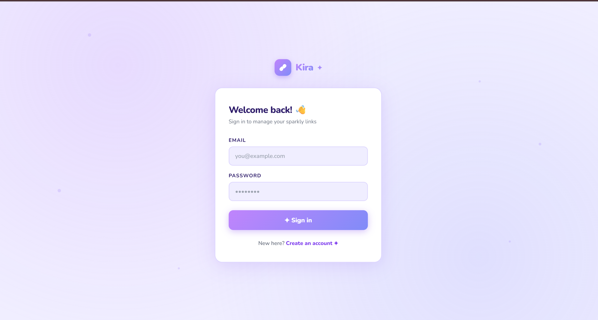
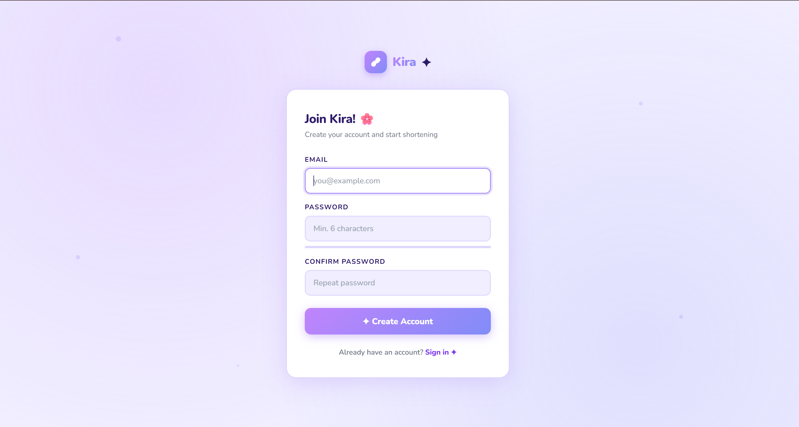
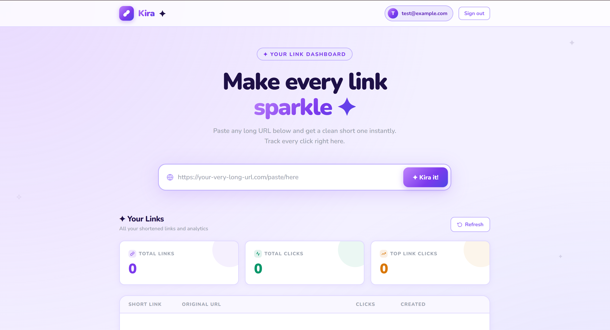
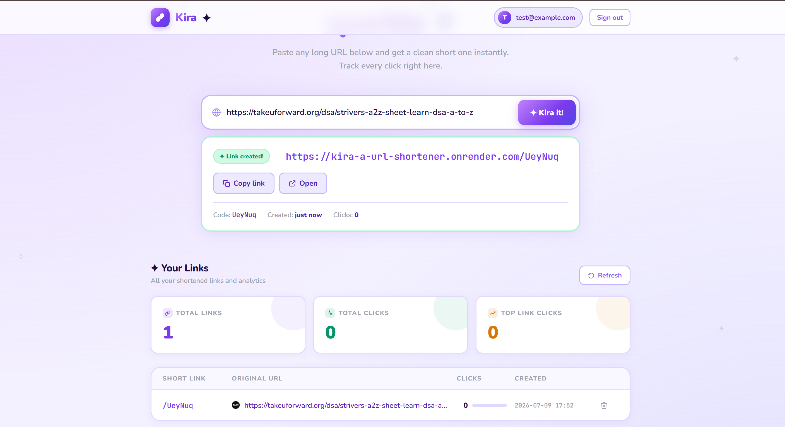
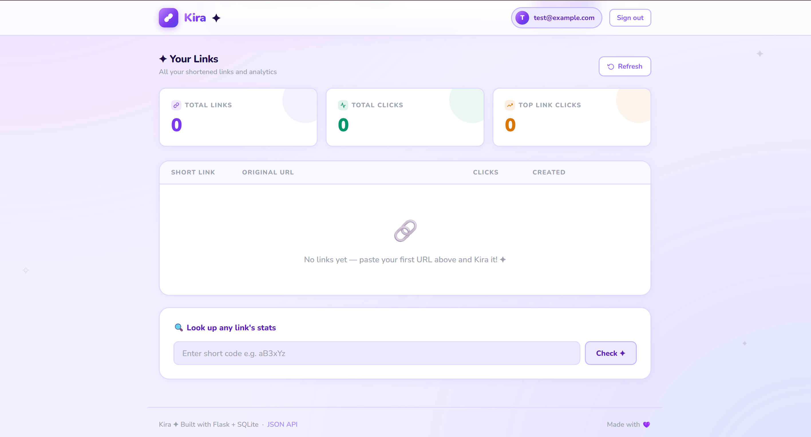
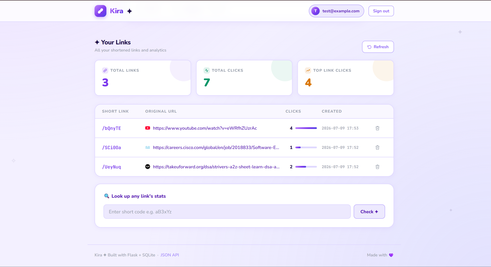

# 🔗 Kira – URL Shortener

A secure and modern URL Shortener web application built with **Flask**, **SQLite**, **HTML**, **CSS**, and **Vanilla JavaScript**. The application allows users to create short URLs, securely manage them through a personal dashboard, and track click statistics in real time.

🌐 **Live Demo:** https://kira-a-url-shortener.onrender.com

💻 **GitHub Repository:** https://github.com/Tam-builds/Kira---A-URL-Shortener

---

## 🎬 Demo

> Add your GitHub video link here after uploading `docs/demo.mp4`

---

## 📸 Screenshots

### Login


### Register


### Dashboard


### Create Short URL


### Analytics Dashboard


### All URLs


---

## ✨ Features

- 🔐 Secure user registration and login
- 🔑 Password hashing using bcrypt
- 🔗 Generate unique 6-character short URLs
- 🚀 Redirect short URLs to their original destination
- 📊 Track click statistics for every URL
- 📂 Personal dashboard for managing links
- 🗑️ Delete previously created URLs
- 📱 Clean and responsive user interface
- 🔌 JSON API endpoints

---

## 🛠️ Tech Stack

| Category | Technology |
|----------|------------|
| Backend | Python, Flask |
| Database | SQLite |
| Authentication | bcrypt, Flask Sessions |
| Frontend | HTML5, CSS3, Vanilla JavaScript |
| Deployment | Render |
| Version Control | Git & GitHub |

---

## 🚀 Getting Started

### Clone the repository

```bash
git clone https://github.com/Tam-builds/Kira---A-URL-Shortener.git
cd Kira---A-URL-Shortener
```

### Create a virtual environment

**Windows**
```bash
python -m venv venv
venv\Scripts\activate
```

**Linux / macOS**
```bash
python3 -m venv venv
source venv/bin/activate
```

### Install dependencies

```bash
pip install -r requirements.txt
```

### Run the application

```bash
python app.py
```

Open:

```text
http://localhost:5000
```

Register an account and start shortening URLs.

---

## 🌐 Deployment (Render)

1. Push the project to GitHub
2. Create a New Web Service on Render
3. Build Command:

```bash
pip install -r requirements.txt
```

4. Start Command:

```bash
gunicorn app:app
```

5. Add environment variable:

```text
SECRET_KEY=your-random-secret-key
```

---

## 🔌 API Endpoints

| Method | Endpoint | Auth | Description |
|--------|-----------|------|-------------|
| GET | `/` | ✅ | Dashboard |
| POST | `/shorten` | ✅ | Create shortened URL |
| GET | `/<code>` | ❌ | Redirect to original URL |
| GET | `/stats/<code>` | ✅ | Retrieve link analytics |
| POST | `/delete/<code>` | ✅ | Delete a link |
| GET | `/api/all` | ✅ | Retrieve all user links |
| GET/POST | `/login` | ❌ | User authentication |
| GET/POST | `/register` | ❌ | User registration |
| GET | `/logout` | ❌ | Logout |

---

## 🔮 Future Improvements

- QR code generation
- Custom short URLs
- Link expiration dates
- Password-protected links
- Search and filter functionality
- Dark mode
- PostgreSQL support
- Docker support

---

## 💡 Skills Demonstrated

- Full-Stack Web Development
- Authentication & Authorization
- Database Design
- CRUD Operations
- Session Management
- RESTful Application Development
- Cloud Deployment
- Git & GitHub Workflow

---

## 💼 Resume Description

Built a full-stack URL shortening application using Flask and SQLite featuring secure user authentication with bcrypt, session management, per-user analytics dashboards, click tracking, and RESTful APIs. Deployed the application on Render.

---

## 👩‍💻 Author

**Tamanna**

GitHub: https://github.com/Tam-builds

---

## ⭐ Support

If you found this project useful, consider giving it a ⭐ on GitHub.